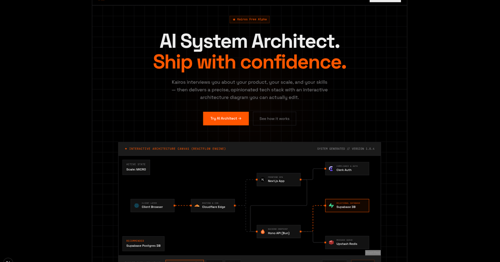

<p align="center">
  
</p>

<h1 align="center">Kairos</h1>
<p align="center">
  <strong>AI System Architect & Tech Stack Advisor</strong>
</p>

<p align="center">
  <a href="#-getting-started">Setup Guide</a> •
  <a href="#-core-journey">Core Journey</a> •
  <a href="#-design-system--ui-philosophy">Design Philosophy</a> •
  <a href="#-license">License</a>
</p>

---



## 🎯 Overview

**Kairos** is an AI-powered conversational architect designed to solve tech stack paralysis for solo developers, indie hackers, and early-stage teams. Instead of asking generic questions or returning standard "it depends" boilerplate, Kairos leads builders through an opinionated, multi-phase discovery flow to understand their product scale, builder constraints, technology philosophies, and database requirements.

The core deliverable is a **production-grade, interactive, node-based system architecture diagram** (rendered on a custom ReactFlow canvas) and a structured migration roadmap. Users can click nodes to view reasons, pricing, and scaling limits, change components in real time (e.g. swap Supabase for Postgres + Redis), and converse with the diagram itself to challenge details or plan growth.

---

## ⚡ Key Features

- **Multi-Phase Conversational Discovery:** Progresses through Project Discovery, Tech Philosophy (using inline MCQ chips), Scale & Timeline selection, Builder constraints, and Non-negotiables.
- **Interactive Visual Architecture Canvas:** Renders a clean ReactFlow diagram depicting your frontend, backend, database, queues, email, and authentication boundaries.
- **Real-Time Architectural Re-reasoning:** Swap out any component (e.g., SQLite/Turso instead of Neon Postgres) directly from the diagram, and watch the AI recalculate database requirements and system interactions.
- **Fail-Safe API Key Rotation:** Out-of-the-box support for rotating, cooling down, and retrying across multiple Google Gemini API keys to bypass rate limits (`429`) seamlessly.
- **Robust Authentication Portals:** Secure session management with Better Auth, integrating Google and GitHub social logins alongside raw credentials.
- **Type-safe Database Layer:** Neon serverless PostgreSQL connection with Drizzle ORM and automatic migrations.
- **Minimalist Stark Design System:** Follows a flat, high-contrast visual design system (0px border-radius, hairline borders, Space Grotesk display headers, JetBrains Mono labels, and distinct Kairos Orange accents).

---

## 🗺️ Core Journey

```
                     User opens Kairos
                             ↓
              Phase 1: Project Discovery
                (Product idea & core workflow)
                             ↓
              Phase 1.5: Tech Philosophy
                (Clickable MCQ chips & custom text)
                             ↓
              Phase 2: Scale & Timeline
                (Expected users, Nano to Large scale)
                             ↓
              Phase 3: Builder Context
                (Team size, language expertise, budget)
                             ↓
              Phase 4: Constraints
                (GDPR, HIPAA, legacy software locks)
                             ↓
              Phase 5: Recommendation Generation
                (Detailed text + cost breakdown)
                             ↓
              Phase 6: Interactive Diagram
                (ReactFlow node rendering & node swapping)
                             ↓
              Phase 7: Follow-up deep dive
                (Conversational diagram adjustments)
```

---

## 🛠️ Stack & Technologies

### Frontend & Core

- **Framework:** Next.js 16 (App Router)
- **Runtime:** Bun
- **Styling:** Tailwind CSS v4 (Pure Vanilla CSS approach, CSS variables)
- **Component Primitives:** Base UI (by Radix/MUI), shadcn/ui custom primitives
- **Interactive Diagramming:** `@xyflow/react` (ReactFlow v12) & `@dagrejs/dagre` for automated vertical/horizontal layout trees
- **State Management:** Zustand & TanStack React Query v5

### Backend & Database

- **ORM:** Drizzle ORM
- **Database:** PostgreSQL (Neon Serverless)
- **Authentication:** Better Auth (Google, GitHub OAuth, and Password pathways)
- **AI Integration:** Google Gemini API (`@ai-sdk/google` & SDK core)

---

## 🚀 Getting Started

### Prerequisites

Make sure you have [Bun](https://bun.sh) installed.

### 1. Clone & Install Dependencies

```bash
git clone https://github.com/your-username/kairos.git
cd kairos
bun install
```

### 2. Configure Environment Variables

Copy the example environment file and fill in your keys:

```bash
cp .env.example .env.local
```

Open `.env.local` and add:

- `DATABASE_URL` (Neon PostgreSQL database connection string)
- `BETTER_AUTH_SECRET` (A random 32-character key)
- OAuth credentials for Google & GitHub (registered on their developer portals)
- `GEMINI_KEY_1` (Your Google AI Studio API key)

_Note: You can add `GEMINI_KEY_2`, `GEMINI_KEY_3`, etc., in sequence if you wish to run with automatic rate limit rotation._

### 3. Setup the Database Schema

Push the schemas to your Neon instance:

```bash
bun db:push
```

Alternatively, you can run Drizzle's migration commands:

```bash
# Generate SQL migrations
bun db:generate

# Apply migrations to database
bun db:migrate
```

To view or manage database entries in a GUI:

```bash
bun db:studio
```

### 4. Start the Development Server

```bash
bun dev
```

Open [http://localhost:3000](http://localhost:3000) in your browser to run the app.

---

## 🎨 Design System & UI Philosophy

Kairos is designed to look like a high-end developer tool. Key traits include:

- **0px Border Radius:** Perfectly sharp, 90-degree corners on everything (buttons, inputs, cards, boxes). No pill shapes.
- **Continuous Hairline Borders:** Structured grid frames and bounding 1px lines (`var(--border)`) define panels rather than drop shadows.
- **Accent Color:** Stark desaturated background scales dynamically interrupted by **Kairos Orange (`#FF5500`)**.
- **Material Symbols Sharp:** Consistent sharp-contoured iconography across the dashboard.

For details, view [docs/DESIGN.md](docs/DESIGN.md) and [docs/PHILOSOPHY.md](docs/PHILOSOPHY.md).

---

## 📄 License

This project is licensed under the MIT License - see the [LICENSE](LICENSE) file for details.
