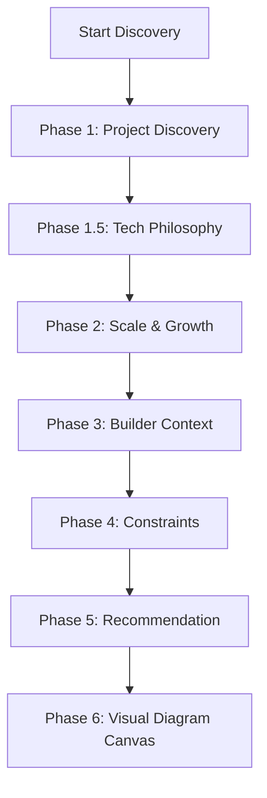

# Kairos — Automated Browser Test Scenarios (MCQ-Hybrid & Tech Philosophy)

Login Credentials
Email: internode.admin@gmail.com
Password: Internode@12686

Always create a new workspace/blueprint for a new test scenario

This document contains highly unique, realistic user test scenarios for the Kairos conversational architect discovery flow. Each scenario mimics a real developer persona with a specific technical philosophy, project idea, and operational constraints.

These scenarios are structured for **AI Browser Agents** to execute step-by-step and verify the correctness of the MCQ-hybrid UI, phase transitions, and recommendation engine biases.

---

## 🏗️ UI Layout Reference for the Browser Agent

When interacting with the Kairos workspace:
1. **Begin Discovery**: Click the `BEGIN DISCOVERY` orange button inside the chat panel on initial load.
2. **MCQ Chips**: Clickable buttons that render inside the assistant message block. They change border/background color to orange (`#FF5500`) when selected.
   - For `allowMultiple: false` (single select), clicking a chip automatically submits that option as a message and scrolls.
   - For `allowMultiple: true` (multi select), click all desired chips, then click the `CONFIRM SELECTION (N)` button.
3. **Subjective Input Panels**: Textareas with label headers that render inline beneath the chat bubbles. Type the text, then click the standard horizontal `send` icon button to submit (or press Enter without Shift).
4. **Floating Input Bar**: Located at the bottom of the chat panel. Used only for the initial Discovery phase, follow-ups, or if no interactive blocks are present.
5. **Phase Tracking**: Check the left sidebar to verify that the active phase tab automatically highlights and progresses (e.g., `Discovery` ➔ `Tech Philosophy` ➔ `Scale & Growth` ➔ `Builder Context` ➔ `Constraints` ➔ `Recommendation` ➔ `Visual Diagram`).

---

## 🧪 Persona Test Suite

---

### 🟢 Scenario 1: The Bleeding-Edge Edge/Serverless Developer
* **Goal**: Build a real-time collaborative Chess game with extremely low latency.
* **Tech Preference**: Edge-first runtime, query builders, managed serverless hosting.

#### Step-by-Step Execution:

| # | Phase / UI State | Agent Action | Expected UI & AI Reaction |
|---|---|---|---|
| **1** | Welcome | Click the **`BEGIN DISCOVERY`** button inside the chat box. | Chat initiates. AI asks what the user wants to build. |
| **2** | Discovery (Free Text) | Type in the bottom floating textarea: `I want to build a real-time multiplayer collaborative board game platform, specifically Chess. Users should be able to create lobbies, pair with other players, and play. The board state must sync instantly between players.` Click send. | AI acknowledges the real-time board sync requirement, identifies category as a real-time gaming platform, and transitions the active sidebar tab to **`Tech Philosophy`**. |
| **3** | Tech Philosophy (MCQ) | Click the chip **`Cloudflare Workers/Pages 🟡`** under Cloud Preference. | Single-select immediately sends the message. AI reacts by asking about Infrastructure philosophy. |
| **4** | Tech Philosophy (MCQ) | Click the chip **`Fully managed / Serverless ☁️`** under Infrastructure Philosophy. | Auto-submits. AI moves to Group 2 questions (Language & Architecture). |
| **5** | Tech Philosophy (MCQ) | Click the chip **`Bleeding Edge / Performant (Rust, Bun, Zig, Elixir) ⚡`** under Language Era. | Auto-submits. AI asks about Stack Architecture. |
| **6** | Tech Philosophy (MCQ) | Click the chip **`Hybrid / Next.js serverless 🔄`** under Stack Architecture style. | Auto-submits. AI moves to Group 3 questions (Tooling & Vendor Stance). |
| **7** | Tech Philosophy (MCQ) | Click the chip **`Query builders (Drizzle, Knex) 🔧`** under ORM preference. | Auto-submits. AI asks about Vendor Lock-in. |
| **8** | Tech Philosophy (MCQ) | Click the chip **`Fine with it ✨`** under Vendor Lock-in Tolerance. | Auto-submits. AI renders a subjective input block for final preferences. |
| **9** | Tech Philosophy (Subjective) | In the inline subjective textarea, type: `I love TypeScript, tRPC, fast edge databases like D1 or Hyperdrive, and absolutely hate cold starts.` Click the Send button inside that panel. | AI records the preference for edge databases/tRPC, confirms the Tech Philosophy is complete, and shifts the sidebar to **`Scale & Growth`**. |
| **10** | Scale & Growth (MCQ) | Click **`Nano (< 500 users) 🌱`** for Month 1. | Auto-submits. AI asks for Month 6. |
| **11** | Scale & Growth (MCQ) | Click **`Small (10K–100K users) 🌿`** for Month 6. | Auto-submits. AI asks for launch timeline. |
| **12** | Scale & Growth (MCQ) | Click **`< 1 month (Bleeding fast) ⚡`** for launch timeline. | Auto-submits. AI assigns the **Nano/Micro** scale tier and shifts sidebar to **`Builder Context`**. |
| **13** | Builder Context (MCQ) | Click **`Solo Developer 🧑‍💻`** for Team Size. | Auto-submits. AI asks for language comfort. |
| **14** | Builder Context (MCQ) | Click **`TypeScript/JavaScript 🟨`** for Language Preference. | Auto-submits. AI asks for Budget. |
| **15** | Builder Context (MCQ) | Click **`Bootstrapped ($0 budget) 🎒`** for Budget Stage. | Auto-submits. AI asks for DevOps comfort. |
| **16** | Builder Context (MCQ) | Click **`1 — No servers, please (Managed only) 🤫`** for DevOps rating. | Auto-submits. AI reflects on the DevOps score of 1 and shifts sidebar to **`Constraints`**. |
| **17** | Constraints (MCQ Multi) | Click **`None / Greenfield project 🌱`** and then click the **`Confirm Selection (1)`** button. | Submits options. AI asks about legal compliance requirements. |
| **18** | Constraints (MCQ Multi) | Click **`GDPR (European privacy) 🇪🇺`** and then click **`Confirm Selection (1)`**. | Submits GDPR constraint. AI renders subjective block for mandates. |
| **19** | Constraints (Subjective) | In the subjective textarea, type: `No strict compliance except basic GDPR privacy. Must have zero baseline cost since we are bootstrapped.` Click Send inside the panel. | AI notes the $0 baseline cost requirement, acknowledges constraints are captured, and offers to generate the recommendation. |
| **20** | Recommendation | Type in the bottom bar: `Yes, generate the recommendation.` | AI enters Phase 5. The sidebar shifts to **`Recommendation`**. AI streams a structured architectural breakdown. |

#### 🎯 Optimal Expected Recommendation Results (Verification Gate):
* **Runtimes/Frameworks**: Suggests **Bun** running on **Cloudflare Workers/Pages** with **Hono** framework (optimized for zero cold starts and edge execution).
* **Database**: Recommends **Cloudflare D1** or **Neon Serverless PostgreSQL** (with zero baseline cost and serverless pricing).
* **ORM**: Recommends **Drizzle ORM** (highly typesafe, performant, query builder preference).
* **Auth**: Recommends **Better Auth** (zero baseline cost, self-hosted edge friendly) or **Clerk** free tier.
* **Baseline Cost**: Renders a cost table proving the baseline is **$0/month** by leveraging Cloudflare's and Neon's generous free tiers.

---

### 🔵 Scenario 2: The Enterprise Legacy Migrator
* **Goal**: Re-platform an old server-bound IoT energy dashboard to a modern containerized cloud structure.
* **Tech Preference**: GCP, C#/.NET Core, legacy monolith stability, heavy ORM, strict compliance.

#### Step-by-Step Execution:

| # | Phase / UI State | Agent Action | Expected UI & AI Reaction |
|---|---|---|---|
| **1** | Welcome | Click **`BEGIN DISCOVERY`**. | Discovery begins. |
| **2** | Discovery (Free Text) | Type: `We are migrating a legacy corporate IoT energy consumption dashboard. The application gathers high-volume meter readings, aggregates historical data, and generates monthly audits.` | AI acknowledges IoT energy domain, identifies analytical and file-heavy nature of data, and moves sidebar to **`Tech Philosophy`**. |
| **3** | Tech Philosophy (MCQ) | Click **`GCP (Google Cloud) 🔵`**. | Submits choice. AI asks for Infra stance. |
| **4** | Tech Philosophy (MCQ) | Click **`Container-friendly (e.g. Cloud Run, ECS) 📦`**. | Submits choice. AI asks for language era. |
| **5** | Tech Philosophy (MCQ) | Click **`Legacy Proven (Java, .NET, PHP, Ruby) ☕`**. | Submits choice. AI asks for stack preference. |
| **6** | Tech Philosophy (MCQ) | Click **`Monolith (Single codebase) 🏢`**. | Submits choice. AI asks for ORM preference. |
| **7** | Tech Philosophy (MCQ) | Click **`Love ORMs (Prisma, TypeORM, Hibernate) ❤️`**. | Submits choice. AI asks for Vendor stance. |
| **8** | Tech Philosophy (MCQ) | Click **`Avoid at all costs (Must be self-hostable) 🛡`**. | Submits choice. AI renders final subjective block. |
| **9** | Tech Philosophy (Subjective) | Type: `We must use C#/.NET Core and Entity Framework Core because our entire engineering department consists of .NET developers.` Click send. | AI notes legacy monolith, C#/.NET, EF Core preference, and switches sidebar to **`Scale & Growth`**. |
| **10** | Scale & Growth (MCQ) | Click **`Micro (500–10K users) 🌿`** for Month 1. | Submits choice. AI asks for Month 6. |
| **11** | Scale & Growth (MCQ) | Click **`Small (10K–100K users) 🌿`** for Month 6. | Submits choice. AI asks for launch timeline. |
| **12** | Scale & Growth (MCQ) | Click **`3–6 months ⏳`** for timeline. | Submits choice. AI assigns **Small** tier and shifts sidebar to **`Builder Context`**. |
| **13** | Builder Context (MCQ) | Click **`3–5 People 🚀`**. | Submits choice. AI asks for primary language. |
| **14** | Builder Context (MCQ) | Click **`C# / .NET 🔷`**. | Submits choice. AI asks for budget. |
| **15** | Builder Context (MCQ) | Click **`Enterprise budget 🏛️`**. | Submits choice. AI asks for DevOps tolerance. |
| **16** | Builder Context (MCQ) | Click **`3 — Some Docker / Server administration 🐳`**. | Submits choice. AI notes enterprise tier and shifts to **`Constraints`**. |
| **17** | Constraints (MCQ Multi) | Click **`AWS / GCP cloud account ☁️`** and **`PostgreSQL / MySQL database 💾`**, then click **`Confirm Selection (2)`**. | Submits tools. AI asks about legal compliance. |
| **18** | Constraints (MCQ Multi) | Click **`SOC2 security audit 🛡️`** and **`GDPR (European privacy) 🇪🇺`**, then click **`Confirm Selection (2)`**. | Submits compliance. AI renders subjective mandates. |
| **19** | Constraints (Subjective) | Type: `All data persistence must reside in our private VPC on GCP. No third-party SaaS for database hosting (like Neon or Supabase Cloud) is legally allowed.` Click send. | AI registers VPC database restriction, confirms constraints complete, and prepares to generate stack recommendation. |
| **20** | Recommendation | Type: `Generate recommendation.` | AI generates recommendations under Phase 5. |

#### 🎯 Optimal Expected Recommendation Results (Verification Gate):
* **Language & Runtime**: Suggests **C# / .NET 8 or 9** running in a unified, containerized **Docker** environment (highly modular legacy-proven monolith).
* **Database**: Recommends **PostgreSQL** deployed via **Google Cloud SQL** inside a private VPC subnet (respects GCP and VPC constraints).
* **ORM**: Recommends **Entity Framework Core (EF Core)** (heavy ORM preference).
* **Hosting**: Suggests hosting containers via **GCP Cloud Run** (with min instances for high availability) or **GKE (Google Kubernetes Engine)**.
* **Auth**: Reends **Better Auth** (configured as self-hosted on Cloud Run connecting to Cloud SQL PostgreSQL) to keep all auth details strictly self-hosted (respecting vendor lock-in avoidance).

---

### 🟡 Scenario 3: The Indifferent Indie Hacker
* **Goal**: Build an AI-powered SaaS with a mobile/web view that ships in days.
* **Tech Preference**: Zero operational overhead, standard Next.js, Supabase, Stripe payments.

#### Step-by-Step Execution:

| # | Phase / UI State | Agent Action | Expected UI & AI Reaction |
|---|---|---|---|
| **1** | Welcome | Click **`BEGIN DISCOVERY`**. | Discovery starts. |
| **2** | Discovery (Free Text) | Type: `I am building an AI-powered recipe generator. The user takes a picture of their fridge and our application uses an LLM to generate healthy meal ideas. Features a subscription plan.` | AI acknowledges AI/ML computer vision component, subscription monetization, and switches to **`Tech Philosophy`**. |
| **3** | Tech Philosophy (MCQ) | Click **`No strong preference ⚪`**. | Submits choice. |
| **4** | Tech Philosophy (MCQ) | Click **`Fully managed / Serverless ☁️`**. | Submits choice. |
| **5** | Tech Philosophy (MCQ) | Click **`Modern Standard (TypeScript, Go, Python) 🚀`**. | Submits choice. |
| **6** | Tech Philosophy (MCQ) | Click **`Hybrid / Next.js serverless 🔄`**. | Submits choice. |
| **7** | Tech Philosophy (MCQ) | Click **`Query builders (Drizzle, Knex) 🔧`**. | Submits choice. |
| **8** | Tech Philosophy (MCQ) | Click **`Fine with it ✨`**. | Submits choice. |
| **9** | Tech Philosophy (Subjective) | Type: `I want to use Supabase, Next.js, and Stripe for billing. High velocity is my only target.` Click send. | AI registers Next.js, Supabase, and Stripe biases. Moves sidebar to **`Scale & Growth`**. |
| **10** | Scale & Growth (MCQ) | Click **`Micro (500–10K users) 🌿`** for Month 1. | Submits choice. |
| **11** | Scale & Growth (MCQ) | Click **`Small (10K–100K users) 🌿`** for Month 6. | Submits choice. |
| **12** | Scale & Growth (MCQ) | Click **`< 1 month (Bleeding fast) ⚡`**. | Submits choice. AI assigns **Nano/Micro** tier and moves to **`Builder Context`**. |
| **13** | Builder Context (MCQ) | Click **`Solo Developer 🧑‍💻`**. | Submits choice. |
| **14** | Builder Context (MCQ) | Click **`TypeScript/JavaScript 🟨`**. | Submits choice. |
| **15** | Builder Context (MCQ) | Click **`Pre-revenue (Some tiny savings) 🌱`**. | Submits choice. |
| **16** | Builder Context (MCQ) | Click **`1 — No servers, please (Managed only) 🤫`**. | Submits choice. AI moves to **`Constraints`**. |
| **17** | Constraints (MCQ Multi) | Click **`Supabase / Firebase 🔥`** and **`Stripe for billing 💳`**, then click **`Confirm Selection (2)`**. | Submits tools. |
| **18** | Constraints (MCQ Multi) | Click **`GDPR (European privacy) 🇪🇺`**, then click **`Confirm Selection (1)`**. | Submits compliance. |
| **19** | Constraints (Subjective) | Type: `Basic GDPR compliance. Needs robust billing integration so we can collect subscriptions easily.` Click send. | AI notes Stripe billing requirement, completes constraints, and prepares to compile recommendation. |
| **20** | Recommendation | Type: `Build the stack.` | AI generates recommendations. |

#### 🎯 Optimal Expected Recommendation Results (Verification Gate):
* **Framework**: Suggests **Next.js App Router** (React-based fullstack framework suited for fast iteration).
* **Database & Auth**: Recommends **Supabase** (PostgreSQL database, fully managed Supabase Auth, and Supabase Storage for fridge photos).
* **Data Access**: Recommends **Drizzle ORM** (TypeScript-native query builder interfacing with Supabase PostgreSQL).
* **Billing**: Suggests **Stripe** (with Stripe checkout or customer portal).
* **Hosting**: Recommends **Vercel** (direct integration with Next.js App Router, fully managed serverless).
* **AI/ML**: Recommends **OpenAI GPT-4o** or **Google Gemini Flash** via the **Vercel AI SDK** (high velocity model integration).
